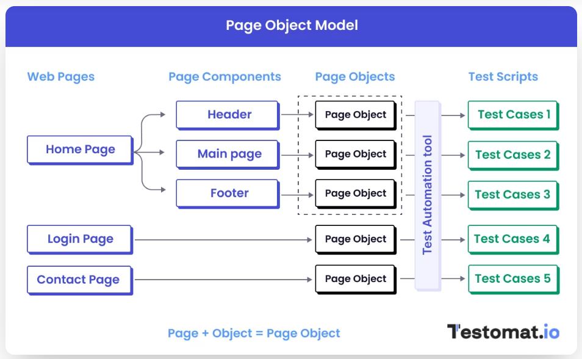
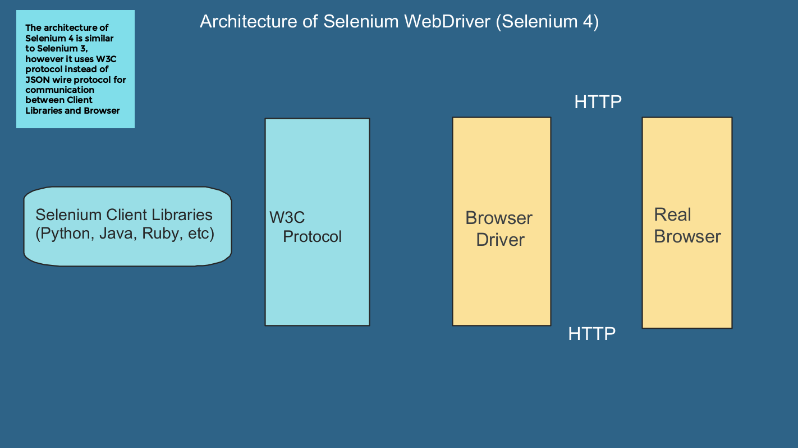

<<<<<<< HEAD

## Selenium Java Framework

**This project is designed and developed with the help of**

- Udemy course (OmPrakash Chavan - Selenium Java Framework) 
- YouTube playlist (Amruthan - Testing Mini Bytes)

## Authors

- [@rahulthorat](https://github.com/rahulvthorat/)

## Test Type

- Smoke
- Sanity
- Regression
- BVT

## Technology Stack

- Selenium
- Java
- TestNG
- Maven
- Git
- GitHub
- Allure
- Jenkins
- Extent Reports

## Browser
- Chrome
- Edge
- FireFox

## implementations

- Retry failed test cases.
- Custom Enums, Exceptions, Annotations.
- Serialization and Deserialization. 
- Data Driven testing using JSON file and DataProvider.
- Automatically open the report after tests execution.
- Zip the ExtentReports directory into Project path.

## ICONS

- Icons addition in ExtentReport
- Browser icon with every test case
- Test status Test Description
- WIN + Browser 
- Navigating to Right
- Details (Add Rahul linkedIn and Github URL)

## Run the Project from Local machine

- Pull the code into your machine and import in IDE (Eclipse/intelliJ).
- Go to testng_Local.xml -> Run this file as TestNG suite It should start the execution -> Parallel Cross Browser Testing.
- NOTE: stg_config.properties is the default configuration file.
- To view the Extent reports.

## Customization
- baseUrl=https://www.saucedemo.com/
- username=standard_user
- password=secret_sauce
- RequestDetailsInExtentReport --> yes or no
- request_details_in_reports=yes
- override_reports=yes
- send_email_to_users=no
- passed_steps_screenshot=yes 
- failed_steps_screenshot=yes 
- skipped_steps_screenshot=yes 
- retry_failed_tests=yes

## Screenshots

## To view the Allure reports

- Setup the Allure in your machine
- Go to URL (https://docs.qameta.io/allure/) -> Search for Manual installation -> Steps are mentioned
- Go to your project location
- Open command prompt -> allure serve allure-results

## Documentation

- Page Object Model

- Selenium Architecture

=======
# Selenium-Java-Framework

